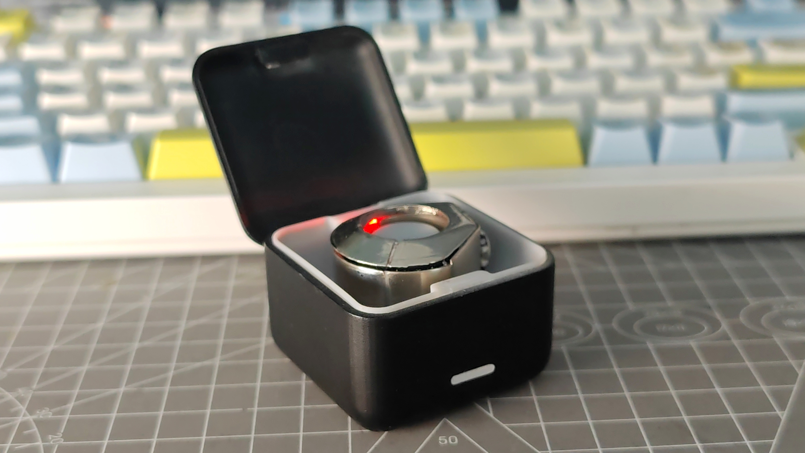
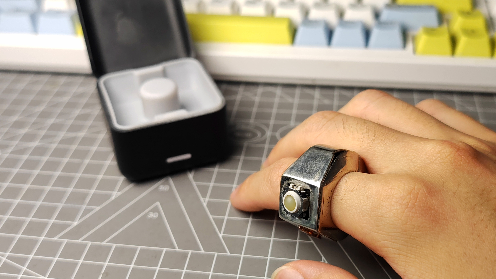
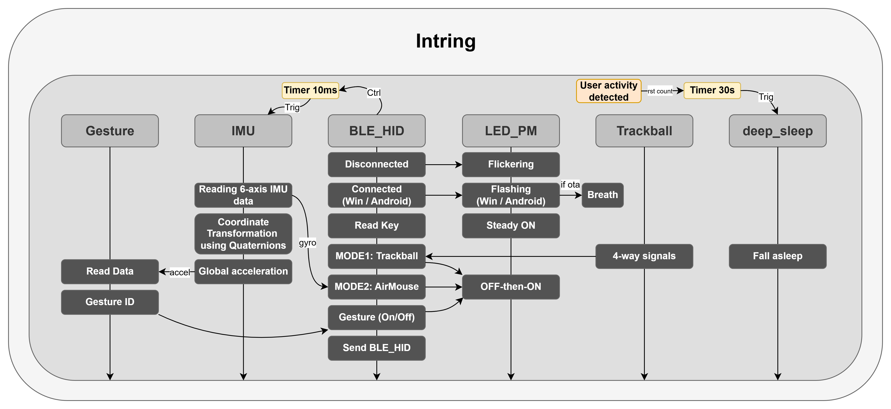

<div align="center">

<h1>Intring</h1>


<div>
<a href="https://github.com/weierruisi/Intring/stargazers" target="_blank"></a>
<a href="https://github.com/weierruisi/Intring/forks" target="_blank"></a>

<a href="./LICENSE"></a>
</div>

简体中文 | <a href="./README_EN.md">English</a>

</div>

---

💡 **Intring** 是一个基于 `ESP32-C3` 的智能交互戒指项目，集成轨迹球、空鼠、手势识别、BLE HID、低功耗休眠与 BLE OTA 升级。

- 📺 演示视频：[Bilibili](https://www.bilibili.com/video/BV1hXLR6JEks/)
- 🧩 硬件资料：[Intring V1](https://www.jlc-ycs.com/platform/detail/f7513283168043cfa72ec83cd0e0180a) / [充电仓](https://www.jlc-ycs.com/platform/detail/a2e6c5c35f034d558feaef7857bcfce5?type=1)
- 🚀 适用场景：迷你鼠标、体感遥控、演示控制、移动端快捷操作
- 👓 适用设备：AR/VR/MR眼镜、平板、PC等
- **复刻过程中遇到问题，请加入QQ群讨论：937579864**

## 📷 实物图

| 充电仓&戒指 | 佩戴效果 |
| --- | --- |
|  |  |


> [!NOTE]
> 本 README 聚焦“怎么用、怎么配、每个按键做什么”。
> 如果你是首次接触本项目，建议从“快速导航”开始。

## 💡 项目概览

| 项目 | 内容 |
| --- | --- |
| 📺 演示视频 | [Bilibili](https://www.bilibili.com/video/BV1hXLR6JEks/) |
| 🧩 硬件下载 | [Intring V1](https://www.jlc-ycs.com/platform/detail/f7513283168043cfa72ec83cd0e0180a)<br>[充电仓](https://www.jlc-ycs.com/platform/detail/a2e6c5c35f034d558feaef7857bcfce5?type=1) |
| 🔧 主控芯片 | `ESP32-C3` |
| 📡 主要通信 | `BLE HID` / `BLE OTA` |
| 🛠️ 目标 IDF | `ESP-IDF v5.3.1` |
| 🔄 OTA 分区策略 | `ota_0` / `ota_1` |

## 🧭 快速导航

| 入口 | 说明 |
| --- | --- |
| 🧱 [系统框图](#系统框图) | 对项目功能实现的简要说明 |
| 🚀 [使用说明](#使用说明) | 首次烧录、BLE OTA 升级与空鼠校准 |
| 🔌 [引脚配置方式与默认配置](#引脚配置方式与默认配置) | 改板和接线时优先看这里 |
| 🧪 [功能说明（详细）](#功能说明详细) | 按键、模式、手势完整行为说明 |
| 📁 [项目目录结构](#项目目录结构) | 快速定位代码目录 |
| 🧰 [tools 工具说明与使用](#tools-工具说明与使用) | OTA、采集、训练脚本使用方式 |
| 📜 [许可证](#许可证) | 软件源码与硬件资料的授权边界 |

---

<a id="使用说明"></a>

## 🚀 使用说明

### 1. 串口烧录（首次烧录必须）

首次使用必须通过串口烧录完整固件，后续才可以使用 BLE OTA 无线升级。

1. 将 FPC 主板和下载器连接，并将下载器接入电脑。
2. 手动进入下载模式：按住 `BOOT` 按键 -> 按下 `RST` 按键 -> 松开 `RST` 按键 -> 松开 `BOOT` 按键。
3. 编译工程并通过 `esptool.py` 将固件刷写到 `ESP32-C3` 中。

```bash
idf.py build
python -m esptool --chip esp32c3 --port <PORT> --baud 460800 write_flash @build/flash_args
```

> [!TIP]
> `<PORT>` 需要替换为本机串口号，例如 Windows 下的 `COM3`，或 Linux/macOS 下的 `/dev/ttyUSB0`。

### 2. BLE OTA 无线升级（后续更新推荐）

完成首次串口烧录后，后续固件更新推荐使用 BLE OTA。

1. 提前记录 `ESP32-C3` 的 BLE MAC 地址。
2. 将仓库拉取至本地，并编译生成待更新的 `.bin` 文件。
3. 运行 `tools/ota/ble_ota_upload.py`，指定目标 MAC 地址以及待更新的 `.bin` 文件，即可实现固件的无线推送升级。

```bash
python tools/ota/ble_ota_upload.py --address xx:xx:xx:xx:xx:xx --bin build/Intring.bin
```

### 3. 首次使用空鼠校准

初次使用空鼠前，需要先完成一次空鼠校准。

1. 将 Intring 切换到空鼠模式。
2. 将 Intring 平放在桌面上，并保持完全静止。
3. 同时长按 `A + B`，看到 LED 状态指示灯闪烁后即可松开。
4. 松开后 Intring 会自动进行校准，校准期间继续保持静止。
5. 校准完成后 LED 会快闪；蓝牙连接成功后，LED 会切换为常亮。

> [!IMPORTANT]
> 校准期间不要移动或晃动 Intring，否则会影响空鼠姿态基准。

---

<a id="系统框图"></a>

## 🧱 系统框图




---

<a id="引脚配置方式与默认配置"></a>

## 🔌 引脚配置方式与默认配置

### 🛠️ 配置方式

本工程引脚通过 `sdkconfig` 中的 `CONFIG_GPIO_*` 宏配置。建议通过 `menuconfig` 修改，避免手改配置文件带来的配置漂移。

- 入口：`idf.py menuconfig`
- 路径：`inter-ring gpios config`
  - `key gpios config`
  - `trackball direction gpios config`
  - `LED&PM gpio config`
  - `i2c_lsm6ds3tr`

> [!TIP]
> 修改引脚后需要重新编译并烧录，运行中的设备不会动态更新引脚配置。

### 📍 默认引脚（当前 sdkconfig）

| 功能 | 宏 | 默认 GPIO |
| --- | --- | --- |
| 轨迹球按压键 | `CONFIG_GPIO_BALLKEY` | `GPIO8` |
| 触摸键 A | `CONFIG_GPIO_TOUCHKEY_A` | `GPIO4` |
| 触摸键 B | `CONFIG_GPIO_TOUCHKEY_B` | `GPIO2` |
| 轨迹球前 | `CONFIG_GPIO_FORWARD` | `GPIO6` |
| 轨迹球后 | `CONFIG_GPIO_BACK` | `GPIO3` |
| 轨迹球右 | `CONFIG_GPIO_RIGHT` | `GPIO5` |
| 轨迹球左 | `CONFIG_GPIO_LEFT` | `GPIO7` |
| LED / 电源指示 | `CONFIG_GPIO_LED_PM_NUM` | `GPIO10` |
| IMU I2C SDA | `CONFIG_GPIO_I2C_SDA` | `GPIO18` |
| IMU I2C SCL | `CONFIG_GPIO_I2C_SCK` | `GPIO19` |

### ⚠️ 改引脚注意事项

- 触摸键与轨迹球输入是上拉输入、低电平触发，改板时保持同样电气逻辑。
- IMU I2C 改脚后，确认硬件上拉与总线稳定性。
- LED 改脚后，确认对应 GPIO 兼容当前驱动方式（LEDC / GPIO）。

---

<a id="功能说明详细"></a>

## 🧪 功能说明（详细）

### 1. 🧠 系统状态与模式

| 状态 | 取值 | 说明 |
| --- | --- | --- |
| 系统模式 | `Windows` / `Android` | 决定按键与手势映射 |
| 工作模式 | `轨迹球` / `空鼠` | 决定鼠标位移来源 |
| 手势开关 | `ON` / `OFF` | 决定是否消费手势队列 |

### 2. 💻 系统模式切换（Win/Android）

| 触发 | 键值事件 | 行为 |
| --- | --- | --- |
| A + B + BALL 同时按下 | `KEY_TOUCH_A_B_BALL` | Win/Android 切换，写入 NVS，立即重启 |

### 3. 🖱️ 工作模式切换（轨迹球/空鼠）

| 触发 | 键值事件 | 行为 |
| --- | --- | --- |
| A 双击 | `KEY_TOUCH_A_DOUBLE_CLICK` | 轨迹球 <-> 空鼠切换 |

<details>
<summary>切换细节（点击展开）</summary>

- 切到空鼠：激活 IMU、清空空鼠队列、重置空鼠滤波状态、暂停轨迹球任务。
- 切到轨迹球：重置轨迹球状态、恢复轨迹球任务；若手势未开启则关闭 IMU 采样定时器。

</details>

### 4. 🪄 手势识别开关

| 触发 | 键值事件 | 行为 |
| --- | --- | --- |
| B 双击 | `KEY_TOUCH_B_DOUBLE_CLICK` | 手势识别 ON/OFF 切换 |

<details>
<summary>开关时内部动作（点击展开）</summary>

开启时：
- 置位 `HID_DEV_AIR_GESTURE`
- 清空旧手势队列
- 非空鼠模式下也会启动 IMU 与定时器
- 丢弃开启后 1 秒内结果，降低误触发
- 恢复手势任务

关闭时：
- 清除 `HID_DEV_AIR_GESTURE`
- 挂起手势任务并清空 IMU buffer
- 非空鼠模式下关闭 IMU 与定时器

</details>

### 5. 🔄 A+B 长按分支逻辑

| 触发 | 键值事件 | 分支行为 |
| --- | --- | --- |
| A + B 同时长按 | `KEY_TOUCH_A_B_LPRESS` | 非空鼠模式直接重启；空鼠模式下 LED 闪烁后松开，进入校准并写入 NVS |

### 6. ⌨️ 按键行为总表（标准固件）

> [!IMPORTANT]
> 下表基于 `CONFIG_COLLECT_DATA_EN = 0` 的常规使用固件。

| 事件 | 触发键 | 行为 |
| --- | --- | --- |
| 单击 | BALL | 发送鼠标左键按下；松开后发送释放 |
| 单击 | A | 滚轮正向步进（Android 下多步渐进） |
| 单击 | B | 滚轮反向步进（Android 下多步渐进） |
| 长按 | A | 与 A 单击同类动作（附带长按节奏延时） |
| 长按 | B | 与 B 单击同类动作（附带长按节奏延时） |
| 双击 | A | 轨迹球/空鼠切换 |
| 双击 | B | 手势识别开/关 |
| 长按 | A + B | 空鼠模式下触发校准；非空鼠模式下直接重启 |
| 组合 | A + B + BALL | Win/Android 切换并重启 |

### 7. 🧭 手势映射

#### 🪟 Windows 模式

| 手势 | 动作 |
| --- | --- |
| LEFT | 音量减 |
| RIGHT | 音量加 |
| UP | PageDown |
| DOWN | PageUp |
| O | PrintScreen |
| X | Alt + F4 |
| D | Win + D |

#### 🤖 Android 模式

| 手势 | 动作 |
| --- | --- |
| LEFT | 上一曲 |
| RIGHT | 下一曲 |
| UP | 音量加 |
| DOWN | 音量减 |
| O | PrintScreen |
| X | Power |
| D | Win + H |

> [!TIP]
> 音量类手势支持连发步进加速，连续触发会加速，超时后重置。

### 8. 🕹️ 轨迹球与空鼠运行特性

- 轨迹球模式：方向边沿检测 + 反向刹车 + 连击加速 + 斜向归一 + 残差补偿。
- 空鼠模式：IMU 位移换算 + 动态阈值 + 动态滤波，兼顾顺滑与抗抖。

### 9. 💡 LED 与连接行为

| 场景 | LED 行为 |
| --- | --- |
| 未连接 | 快速闪烁 |
| 已连接 | 系统模式提示闪烁后常亮（Win 2 次 / Android 4 次） |
| OTA 传输中 | 呼吸灯 |

### 10. 📊 数据采集固件差异

当 `CONFIG_COLLECT_DATA_EN=1` 时：
- B 键行为会用于采集队列流程。
- 双击分支与标准固件不完全一致。
- 建议该配置仅用于训练数据采集。

---

<a id="项目目录结构"></a>

## 📁 项目目录结构

```text
Intring/
├─ components/
│  ├─ air_mouse/
│  ├─ ble_hid/
│  ├─ ble_ota/
│  ├─ gesture_detect/
│  ├─ key/
│  ├─ light_sleep/
│  └─ LSM6DS3TR/
├─ main/
├─ managed_components/
├─ tools/
│  ├─ ota/
│  └─ nn/
├─ partitions.csv
├─ sdkconfig
├─ README.md
└─ README_EN.md
```

## 🧩 组件说明

| 组件 | 职责 |
| --- | --- |
| `components/ble_hid` | BLE HID、按键映射、模式切换、LED 状态机 |
| `components/ble_ota` | OTA 控制通道、分区写入与重启切换 |
| `components/air_mouse` | 空鼠位移解算、动态门限与滤波 |
| `components/gesture_detect` | 手势推理与动作映射 |
| `components/key` | 按键扫描、去抖、组合键事件 |
| `components/light_sleep` | 休眠倒计时、唤醒源管理 |
| `components/LSM6DS3TR` | IMU 驱动与数据读取 |

---

<a id="tools-工具说明与使用"></a>

## 🧰 tools 工具说明与使用

### 📡 OTA 升级脚本

- 脚本：`tools/ota/ble_ota_upload.py`
- 用途：通过 BLE 传输 OTA 固件。

常用参数：
- `--address`：设备 MAC（必填）
- `--bin`：固件路径（必填）
- `--chunk-size`：分包大小（默认 `244`）
- `--delay-ms`：包间隔（默认 `1`）
- `--no-response`：无响应写（更快但风险更高）

```powershell
python tools/ota/ble_ota_upload.py --address xx:xx:xx:xx:xx:xx --bin build/Intring.bin
```

运行结果示例：

```text
[INFO][0 min 0 s] Firmware: build/Intring.bin
[INFO][0 min 0 s] Size: 980208 bytes
[INFO][0 min 0 s] Address: xx:xx:xx:xx:xx:xx
[INFO][0 min 0 s] CTRL UUID: 0000fff1-0000-1000-8000-00805f9b34fb
[INFO][0 min 0 s] DATA UUID: 0000fff2-0000-1000-8000-00805f9b34fb
[INFO][0 min 0 s] Chunk size: 244
[INFO][0 min 0 s] Data write response: True
[INFO][0 min 12 s] Connected
[INFO][0 min 12 s] CTRL notify enabled
[INFO][0 min 12 s] Send START (0x01)
[NOTIFY] CTRL status: xx
[INFO][0 min 0 s] Progress: 4880/980208 (0.50%), Speed: 5.36 kB/s, Avg: 5.36 kB/s, ETA: 2 min 57 s
...
[INFO][2 min 48 s] Send FINISH (0x02)
```

### 🔌 串口数据采集

- 脚本：`tools/nn/Serial_read.py`
- 用途：串口采集 IMU 数据，保存到 `tools/nn/TraningData/`

```powershell
python tools/nn/Serial_read.py
```

### 📶 BLE 数据采集示例

- 脚本：`tools/nn/collect_data.py`
- 用途：BLE 通知采集并保存 CSV（默认 `tools/nn/dataset/`）

```powershell
python tools/nn/collect_data.py --label wave --duration 2.0
```

### 🧠 模型训练与导出

- 脚本：`tools/nn/train_model.py`
- 用途：训练模型并导出 `gesture_model_quant.tflite` 与 `gesture_model.cc`

```powershell
python tools/nn/train_model.py
```

---

## 🧷 版本与兼容说明

- 目标芯片：`ESP32-C3`
- ESP-IDF：`v5.3.1`
- 分区策略：双 OTA 分区（`ota_0` / `ota_1`）

## 🛡️ 维护建议

- 升级前确认设备 MAC，避免误发。
- OTA 前保持电量充足，避免中断。
- 替换手势模型后，同步更新 `components/gesture_detect/gesture_model.cc` 并重新编译。

<a id="许可证"></a>

## 📜 许可证

本仓库中的固件与软件源码基于 [Apache License 2.0](./LICENSE) 开源。
> [!WARNING]
> 硬件设计文件未包含在本仓库中，例如原理图、PCB、Gerber、BOM、结构文件等。相关硬件资料在硬创社单独提供，具体授权与使用范围以硬创社页面说明为准。
> 硬件资料入口：[Intring V1](https://www.jlc-ycs.com/platform/detail/f7513283168043cfa72ec83cd0e0180a) / [充电仓](https://www.jlc-ycs.com/platform/detail/a2e6c5c35f034d558feaef7857bcfce5?type=1)。
